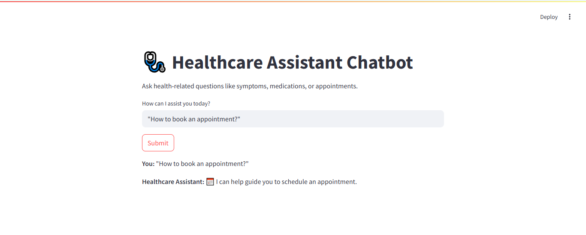

# 🩺 Healthcare Assistant Chatbot

An interactive chatbot built with **Streamlit**, **Hugging Face Transformers**, and **NLTK** that responds to basic health-related queries like symptoms, medications, and appointments. It combines keyword-based logic with a lightweight GPT-2 (`distilgpt2`) model for natural-sounding responses.

---

## 📌 Features

* Conversational UI built using **Streamlit**
* Uses **Hugging Face's** `distilgpt2` via `pipeline` for AI-powered text generation
* **NLTK** used for basic NLP preprocessing
* Provides instant responses to:

  * Symptoms
  * Medication queries
  * Appointments
  * Emergency keywords
* Intelligent fallback to GPT when no keyword matches
* Clean output formatting with emojis for clarity

---

## 🛠️ Tech Stack

* Python
* Streamlit
* Transformers (`distilgpt2` model)
* NLTK
* TensorFlow
* VS Code

---

## 💻 How to Run This Project Locally

### ✅ Step-by-step Setup

1. **Navigate to the folder** where your project is saved.

2. **Create a virtual environment**:

```bash
python -m venv venv
venv\Scripts\activate  # for Windows
# OR
source venv/bin/activate  # for macOS/Linux
```

3. **Install dependencies**:

```bash
pip install -r requirements.txt
```

If you don't have `requirements.txt`, install manually:

```bash
pip install streamlit transformers nltk tensorflow
```

4. **Run the chatbot**:

```bash
streamlit run app.py
```

It will launch in your browser at: `http://localhost:8501`

---

## 💬 Sample Questions to Try

| User Input                                     | Expected Assistant Response                                   |
| ---------------------------------------------- | ------------------------------------------------------------- |
| How to book an appointment?                    | 🗓️ I can help guide you to schedule an appointment.          |
| What are symptoms of fever?                    | 💉 It's best to consult a healthcare provider about symptoms. |
| Can I take ibuprofen and paracetamol together? | (Response generated by GPT-2)                                 |
| This is an emergency!                          | ⚠️ Please contact emergency services immediately.             |

---

## 🖼️ Sample Output Screenshot



> 💡 *Make sure the screenshot file **`output.png`** is in your project folder.*

---

## 📁 Project Structure

```
Healthcare-Assistant-Chatbot/
│
├── app.py               # Main Streamlit app
├── requirements.txt     # Required packages
├── README.md            # This file
└── output.png           # Output screenshot
```

---

## 📄 Requirements.txt (Example)

```txt
streamlit
transformers
tensorflow
nltk
```

---

## 🙋‍♀️ Developed By

Khushi Srivastava
> Currently learning AI, Web Dev, and DSA. Passionate about real-world tech solutions.

---

> "This chatbot is for **educational/demo** purposes only and not a replacement for professional medical advice."
